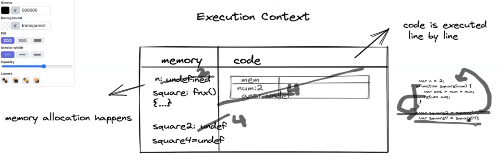

JavaScript is syncronous single thereaded scripting language

## Execution Context 
- Example:
    var n = 2;
    function square(num) {
        var ans = num * num;
        return ans;
    }
    var square2 = square(n);
    var square4 = square(4);

- Memory (variable environment)
    - The memory allocation the variables and the functions that happens here
    - When above mension code is run then 
        - step1: n = undefined (declared),  
        - step2: function square {......} (declared),
        - step3: square2 = undefined,
        - step4: square4 = undefined
        - then go to execution part
- Code
    - code is executed line by line

    - when come to execution part then
    - step1: n is initilized by 2,
    - step2: goto square2 where invoking function square,
    - step3: when will be invoking function then create another execution context inside the global execution context

        - memory
            - In this part, num is initilized by 2 then,
            - ans is initilized by undefined then,
            - go for execution part
        - code
            - when will be come execution part 
            it will execute code which is inside function that is ans = num * num; then
            - it will update ans by 4.
            - then go for then line that is return and return ans
            - when it will return then this execution context will remove and then go for next line
    - step4: When previous line is execution done then go for next line that is square4
    - step5: When it come for square4 then it create another excution context
        - memory: 
            - num is initilized by 4,
            - ans is initilized by undefined
            - then go for execution part

        - code:
            - when it happens then
            - ans = num * num;
            - then ans is updated by 16
            - then it return the ans
            - then it remove the execution context 
- Call Stack - 
    - First store the global execution context then,
    - store square2 execution context and when square2 process will be completed then it will pop out then,
    - it store square4 execution context and it also follow the same.
- All the things is handle by JavaScript engine.

- Whenever code in JS written and whenever it's code is executed some try's to run it. This is where execution context is created. So, execution context is something where your JS code is running and the memory allocation is happing. So, execution context is a block or context where in the memory allocation of code is happing and the code is being executed in simple lines.

## undefine
- It means variable has not initilized.

## not-define
- It means variable is not define.