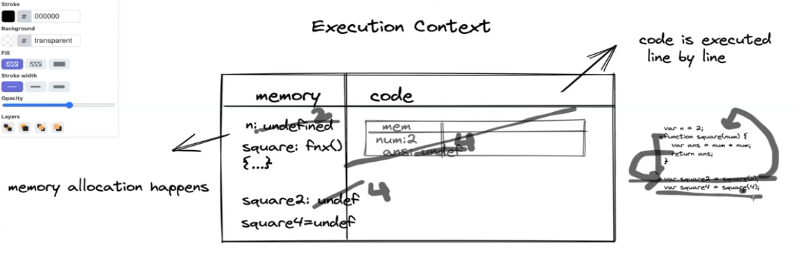

JavaScript is syncronous single thereaded scripting language

## Execution Context 
- Example:
    var n = 2;
    function square(num) {
        var ans = num * num;
        return ans;
    }
    var square2 = square(n);
    var square4 = square(4);

- Memory (variable environment)
    - The memory allocation the variables and the functions that happens here
- Code
    - code is executed line by line

